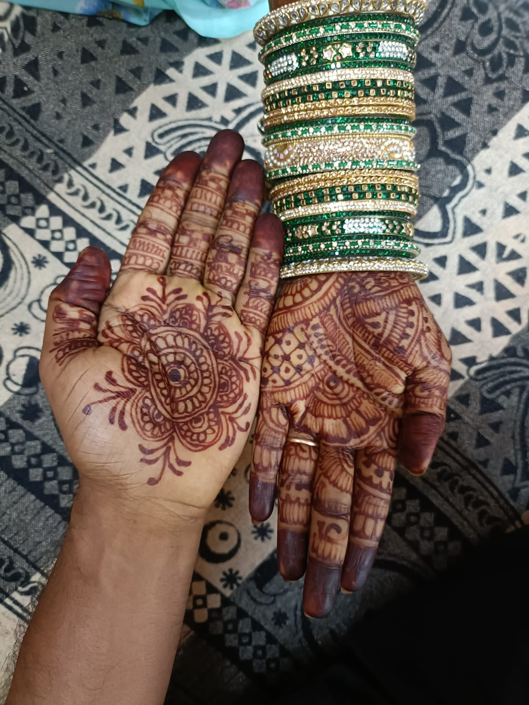
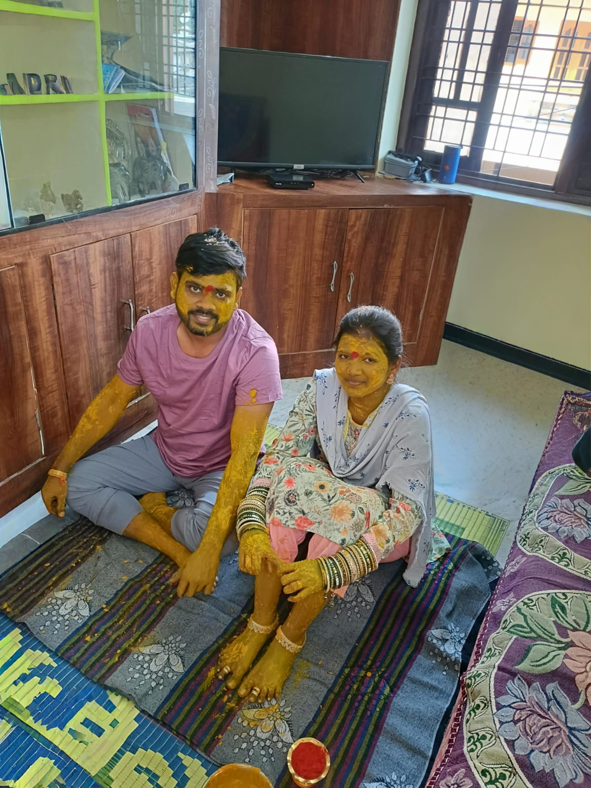

<!DOCTYPE html>
<html>
<head>
    <title>Happy Valentine's Day My Love ❤️</title>
    
</head>
<body>

    <h1>Happy Valentine's Day My Love ❤️</h1>

    

        To my beautiful wife,  
        Every moment with you is a blessing.  
        These 20 beautiful memories of us will always stay in my heart.
    

    <!-- 20 Photo Gallery -->
    

        
        
        
        
        
        
        
        
        
        
        
        
        
        
        
        
        
        
        
        
    

    <!-- Background Music -->
    <audio id="bgMusic" autoplay loop>
        <source src="love_song.mp3" type="audio/mpeg">
        Your browser does not support the audio element.
    </audio>

    <!-- Music Control Button -->
    <button class="btn" onclick="toggleMusic()">🎵 Play/Pause Music</button>

    <!-- Surprise Button -->
    <button class="btn" onclick="showMessage()">Click for Surprise 🎁</button>

    

        I will love you today, tomorrow, and forever.  
        Forever Yours, 
        <strong>My Dear ❤️</strong>
    

</body>
</html>
